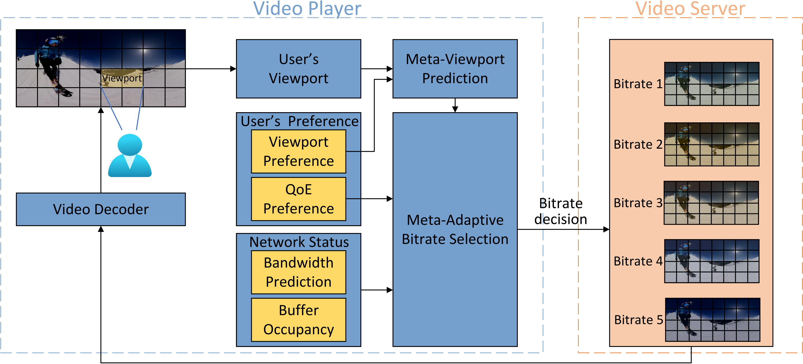
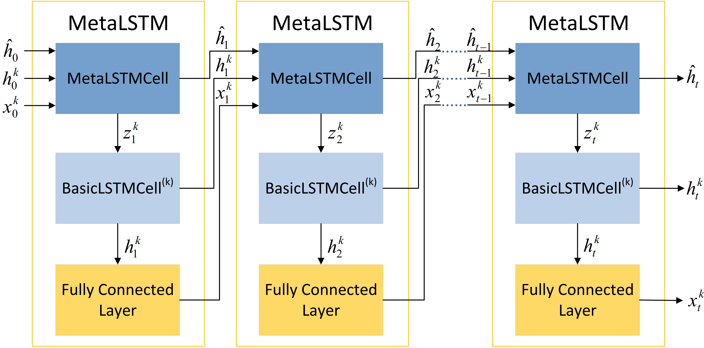
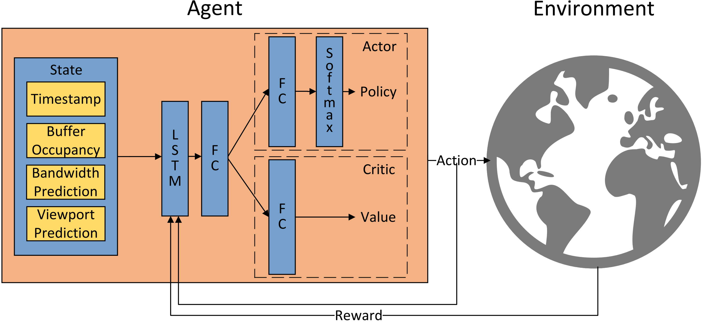

Overall Framework: 
The 360 video streaming framework is splited into 3 parts.
- Video Preprocessing and Viewport Prediction: See `./viewport_prediction`
    - Prepocessing 
      - Entrance: `get_viewport.py`
    - Viewport Prediction 
      - Design: 
      - Entrance: `personalized_meta_train.py`
- Bandwidth Prediction: `./bandwidth_prediction`
    - Design: LSTM
    - Entrance: `train.py`
- Adaptive Bitrate Selection: `./bitrate_adaptation`
    - Design: 
    - Entrance: `train_ac_meta.py`